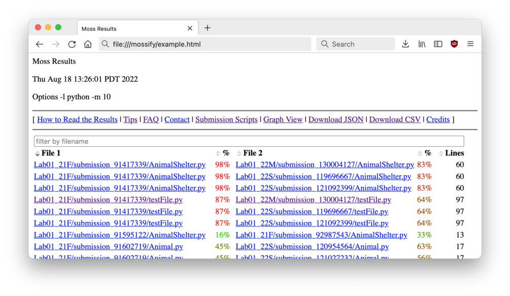
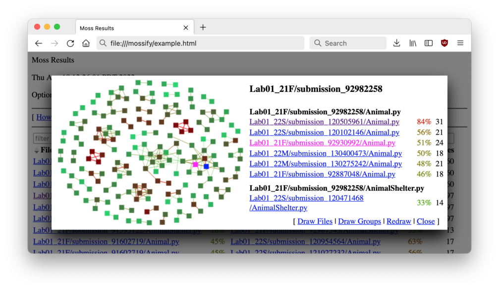

# Mossify

This is a  [WebExtension][webx]  that enhances the  web UI  of the  [Moss][moss]
plagiarism detector.  It's developed on Firefox, but should also work in Chrome,
Safari, Opera, and Edge.

It adds the following features to the main results page:

- Match percentages are separated out and colorized for better readability.
- The results table is now sortable by clicking the column headers.
- The results table can now be filtered by filename.
- Results can be downloaded as JSON or CSV files.

It also adds a graph view to help identify clusters of submissions:

[webx]: <https://developer.mozilla.org/en-US/docs/Mozilla/Add-ons/WebExtensions>
[moss]: <http://moss.stanford.edu>
